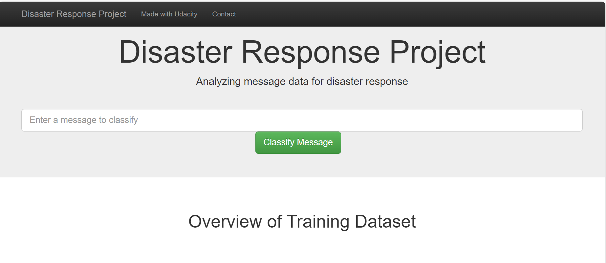

# Disaster Response Pipeline Project
There are 36 pre-defined categories, like Food, Floods, Storm, etc. and we have dataset for messages during the disaster response. We will classify these messages among the categories and send out the message to the related category response team. This project will involve the building of a basic ETL and Machine Learning pipeline to facilitate the task. This is also a multi-label classification task, since a message can belong to one or more categories. We will be working with a data set provided by Figure Eight containing real messages that were sent during disaster events.

Finally, this project contains a web app where you can input a message and get classification results.

### File Description
    - app
    |- template
    | |- master.html  # main page of web app
    | |- go.html  # classification result age of web app
    |- run.py  # Flask file that runs app

    - data
    |- disaster_categories.csv  # data to process 
    |- disaster_messages.csv  # data to process
    |- process_data.py
    |- DisasterResponse.db   # database to save clean data to database 'DisasterResponse.db'

    - models
    |- train_classifier.py
    |- classifier.pkl  # saved model 

    - pipeline-preparation
    |- categories.csv
    |- ETL Pipeline Preparation.ipynb
    |- messages.csv
    |- ML Pipeline Preparation.ipynb
    |- DisasterResponse.db
    |- Machine_classifier.pkl

    - README.md

### Installation:
Run with Python 3 with libraries of numpy, pandas, sqlalchemy, re, NLTK, pickle, Sklearn,
plotly, joblib and flask libraries.

### Instructions:
1. Run the following commands in the project's root directory to set up your database and model.

    - To run ETL pipeline that cleans data and stores in database
        `python data/process_data.py data/disaster_messages.csv data/disaster_categories.csv data/DisasterResponse.db`
    - To run ML pipeline that trains classifier and saves
        `python models/train_classifier.py data/DisasterResponse.db models/classifier.pkl`

2. Run the following command in the app's directory to run your web app.
    `python run.py`

3. Go to http://127.0.0.1:3001

### Licensing, Author and Acknowledgement
Thanks to Figure-8 for making this web app for Udacity program for training purpose.

> Note: Pipeline-preparation folder is not required for web app to run. It is being used for ETL and ML pipeline development and testing.
